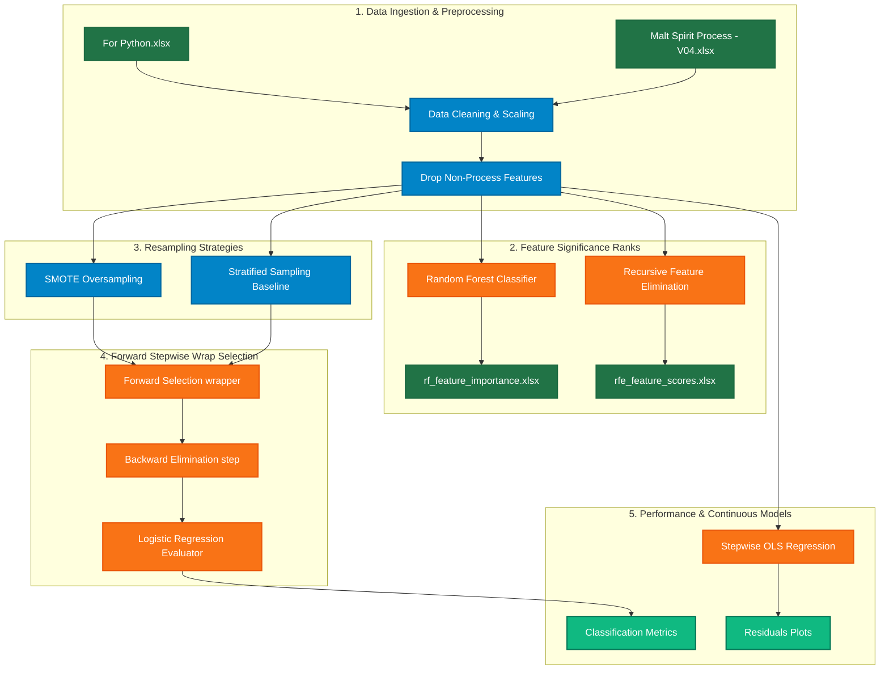

# 🥃 SMART Distillery - Malt Spirit Process Analytics (Python Track)

Welcome to the **SMART Distillery Python Analytics** repository (Track 2). This track contains advanced statistical modeling, machine learning, class-balancing pipelines, and feature selection workflows developed in Python/Jupyter to optimize malt spirit production processes for Diageo.

While the Alteryx track focuses on data ingestion, dynamic range binning, and database joining, this **Python Track** performs high-fidelity predictive modeling, feature significance ranking, and class-balanced classification to isolate key drivers of spirit quality.

---

## 📊 Analytics Pipeline & Architecture

The machine learning and statistical modeling pipeline is designed to systematically handle multi-collinearity, heavy class imbalance, and process parameter significance.



---

## 📁 Repository Structure

### 🧪 Jupyter Notebooks (`.ipynb`)

* **[`Feature Significance.ipynb`](file:///c:/Users/User/Desktop/Kriyanshi/Crg/2nd%20track/Feature%20Significance.ipynb)**:
  * Performs Exploratory Data Analysis (EDA) and initial preprocessing on `For Python.xlsx`.
  * Drops identifiers and non-process attributes (e.g., `Water Sensory`, `Water pH`, `Water TDS`, `Water Hardness`, `Water Chloride`, `Water Alkalinity`, `Mash B#`) to prevent modeling leaks.
  * Fits a **Random Forest Classifier** to extract Gini importance scores.
  * Deploys **Recursive Feature Elimination (RFE)** to rank every single process feature sequentially based on predictive impact.
  * Exports ranked outputs to `rf_feature_importance.xlsx` and `rfe_feature_scores.xlsx`.

* **[`Forward Selections with SMOT.ipynb`](file:///c:/Users/User/Desktop/Kriyanshi/Crg/2nd%20track/Forward%20Selections%20with%20SMOT.ipynb)**:
  * Resolves severe class imbalance in spirit quality labels using **SMOTE** (Synthetic Minority Over-sampling Technique).
  * Implements a custom **Stepwise Forward Feature Selection** wrapper algorithm around **Logistic Regression**.
  * Systematically evaluates test performance at each feature addition/subtraction step, outputting F1-Score, Precision, Recall, Accuracy, and ROC AUC matrices.

* **[`Forward Selections with SMOT and all variables.ipynb`](file:///c:/Users/User/Desktop/Kriyanshi/Crg/2nd%20track/Forward%20Selections%20with%20SMOT%20and%20all%20variables.ipynb)**:
  * A parallel wrapper iteration running SMOTE and Forward Selection across *all* process features, including multi-collinear and redundant ones, to study the algorithm’s robustness against correlation noise.

* **[`Forward Selections with Stratified sampling.ipynb`](file:///c:/Users/User/Desktop/Kriyanshi/Crg/2nd%20track/Forward%20Selections%20with%20Stratified%20sampling.ipynb)**:
  * Serves as the control baseline. Employs traditional **Stratified Train-Test Splitting** without SMOTE oversampling.
  * Directly highlights the statistical decay in minority class recall when class imbalance is uncorrected, demonstrating why SMOTE was introduced.

* **[`Stepwise_reg Primary Approach.ipynb`](file:///c:/Users/User/Desktop/Kriyanshi/Crg/2nd%20track/Stepwise_reg%20Primary%20Approach.ipynb)**:
  * Implements continuous modeling via Ordinary Least Squares (OLS) Stepwise Regression from `statsmodels`.
  * Models key intermediate outcomes (such as `First Wort Collection - Turbidity` and gravity profiles) based on mashing parameters and grist distributions.
  * Validates assumptions with statistical summaries ($R^2$, Adj. $R^2$, F-Statistic, $p$-values) and visualizes diagnostics via Actual vs. Predicted scatter and Residual plots.

---

### 🗃️ Datasets & Statistical Outputs (`.xlsx`)

* **`For Python.xlsx`**: The consolidated dataset featuring process parameters mapped to binary spirit quality target flags (`Quality`: `1` for Yes/Good, `0` for No/Poor).
* **`Malt Spirit Process - Parameters and Outcome - V04.xlsx`**: The master historical production workbook covering the four primary process phases: Mashing, Fermentation, Wash Still, and Spirit Still Distillation.
* **`Malt Spirit Process Parameters - Single Point (Manual) & Continuous (In-line).xlsx`**: Process specification mapping showing manual vs. in-line parameter tags and operating thresholds.
* **`correlation.xlsx`**: Core Pearson correlation matrix identifying collinear features across all phases.
* **`rf_feature_importance.xlsx`**: Tabulated Gini importance scores generated by the Random Forest Classifier.
* **`rfe_feature_scores.xlsx`**: Sequential elimination ranks of process features generated by the RFE estimator.

---

## 🔬 Core Modeling Methodologies

### 1. Handling Skewed Distributions via SMOTE
In the historical spirit logs, batches achieving optimal sensory scores are highly skewed (imbalanced). Standard classification models trained on this data suffer from high accuracy but extremely poor **Recall** for the minority class (missing critical high-quality or low-quality batches). 

By implementing **SMOTE**, the pipeline synthesizes new data points along the line segments joining k-nearest neighbors of the minority class, ensuring the decision boundary of the Logistic Regression classifier is unbiased:

$$\text{F1-Score} = 2 \times \frac{\text{Precision} \times \text{Recall}}{\text{Precision} + \text{Recall}}$$

### 2. Forward Selection Wrapper Algorithm
The custom step-wise forward feature selection operates as follows:
1. **Initialize** with an empty list of features.
2. **Forward Step**: Train models adding one feature at a time from the remaining pool. Identify the variable that maximizes model metric (e.g. Accuracy or AUC). If it exceeds the improvement threshold, permanently add it.
3. **Backward Step**: Evaluate if removing any currently selected feature improves or maintains performance. If yes, remove the feature (Backward Elimination).
4. **Repeat** until no further statistical improvement is registered.

### 3. Stepwise OLS Regression for Continuous Targets
For intermediate stages like Mashing, predictions of turbidity or wort gravity are made using stepwise Ordinary Least Squares (OLS) regression:

$$y = \beta_0 + \beta_1 X_1 + \beta_2 X_2 + \dots + \beta_k X_k + \epsilon$$

Variables are included/excluded based on a rigorous $p$-value threshold ($\alpha_{\text{in}} = 0.05$ and $\alpha_{\text{out}} = 0.05$), ensuring only mathematically significant parameters are mapped into the operational control deck.

---

## 🛠️ Environment Setup & Execution

### Prerequisites
Make sure you have **Python 3.10+** installed. It is highly recommended to run this project in a virtual environment.

### 1. Install Dependencies
Install all required libraries for data processing, machine learning, and visualization:
```bash
pip install pandas numpy scikit-learn imbalanced-learn statsmodels matplotlib seaborn openpyxl jupyter
```

### 2. Configure Local File Paths
Because the raw Jupyter Notebooks reference absolute path strings (e.g. `D:\CRG\Diageo\...`), you will need to update the file paths at the top of each notebook to point to your local copies:
```python
# Replace this line in the notebooks:
df = pd.read_excel(r"D:\CRG\Diageo\For Python.xlsx")

# With your local relative or absolute path:
df = pd.read_excel("./For Python.xlsx")
```

### 3. Running Jupyter Notebooks
Start the Jupyter Notebook server in your terminal:
```bash
jupyter notebook
```
Open the notebooks in your browser and run the cells sequentially to reproduce the correlation tables, feature importance matrices, and predictive models.

---
> [!NOTE]
> This Python track serves as the mathematical validator for the target operating windows deployed in the Alteryx workflows.

> [!TIP]
> When running the forward selection wrappers, pre-filtering highly collinear features (using `correlation.xlsx`) is highly recommended to prevent numerical instability in Logistic Regression.
