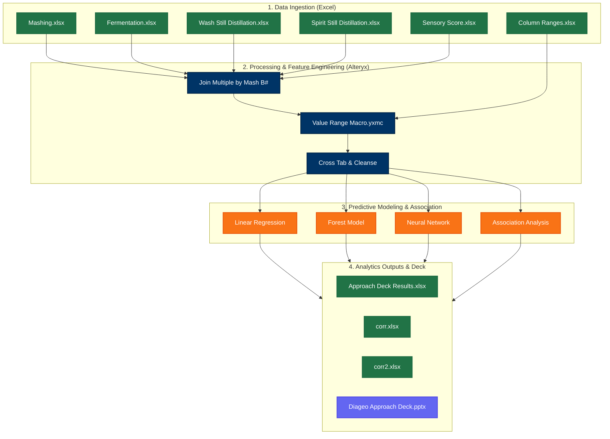

# 🥃 SMART Distillery - Malt Spirit Process Analytics (KT)

Welcome to the **SMART Distillery Knowledge Transfer (KT)** repository. This repository contains the data engineering, statistical modeling, and predictive analytics workflows developed to optimize malt spirit production processes for Diageo. 

By integrating multi-stage distillery data, applying dynamic parameter-range classification, and deploying predictive machine learning models, this project identifies critical process parameters and target operating ranges that directly influence final spirit quality.

---

## 📊 Project Overview & Objectives

In malt spirit distilling, spirit quality is measured by a **Sensory Score** (scale of 1–5). Achieving a consistently high sensory score requires precise control over multiple sequential, highly interdependent phases:
1. **Mashing**: Grist ratios, mashing water chemistry, temperatures, and wort extraction.
2. **Fermentation**: Yeast cell viability, CIP (Clean-In-Place) controls, temperature profiles, and gravity drop.
3. **Wash Still Distillation**: Distillation time, low wine volume, and low wine alcohol percentage.
4. **Spirit Still Distillation**: Head, heart, and tail cut timing, proof tracking, and GC (Gas Chromatography) congener profiles.

### Key Objectives
* **Correlation Mapping**: Determine the mathematical relationship between variables across different stages.
* **Target Operating Windows**: Evaluate whether process parameters falling within pre-defined target ranges significantly improve sensory outcomes.
* **Predictive Quality Modeling**: Build machine learning models (Linear Regression, Random Forest, Neural Networks) to forecast intermediate wort parameters and final sensory scores.
* **Knowledge Transfer (KT)**: Document findings, methodology, and address crucial operational questions regarding data quality, oversampling, and target variable modeling.

---

## 🏗️ System Architecture & Data Flow

The analytics engine is built entirely in **Alteryx** to enable robust data cleaning, batch macro execution, and advanced predictive analysis. Below is the conceptual data flow of the system:

---

## 📁 Repository Structure

### 🗃️ Datasets (Excel Spreadsheets)
* **`Mashing.xlsx`**: Raw process logs for the mashing phase. Tracks grist proportions, water chemical parameters (pH, TDS, hardness, alkalinity), sparging temperatures, and first wort extraction quality.
* **`Fermentation.xlsx`**: Process logs for fermentation. Includes yeast addition, CIP caustic strength/solution temperature, wash gravity profiles, alcohol %, and final wash pH.
* **`Wash Still Distillation.xlsx`**: Process metrics for low wine production in the wash still.
* **`Spirit Still Distillation.xlsx`**: Logs cut times, feints recovery proof, congener profiles via Gas Chromatography (Methanol, Acetaldehyde, n-Propanol, Iso-Butanol, Iso-Amyl Alcohol, Ethyl Acetate), and sensory components (fruity/floral, starchy, cereal).
* **`Sensory Score.xlsx`**: The primary target metric representing spirit quality on a scale from 1 (poor) to 5 (excellent).
* **`Column Ranges.xlsx`**: Operating bounds (lower/upper limits) for key process features used to determine "in-range" compliance.
* **`corr.xlsx` / `corr2.xlsx`**: Statistical correlation matrices outputted directly from Alteryx workflows.
* **`Approach Deck Results.xlsx`**: Aggregated performance metrics and correlation results summarizing model findings.

### ⚙️ Alteryx Batch Macro (`.yxmc`)
* **[`Value Range Macro.yxmc`](file:///c:/Users/User/Desktop/Kriyanshi/Crg/SMART%20Distillery%20-%20KT/SMART%20Distillery/Value%20Range%20Macro.yxmc)**: A dynamic, reusable Alteryx batch macro. It takes column-specific ranges defined in `Column Ranges.xlsx` and loops through the merged process dataset, generating binary indicator flags (`_New` columns: `1` if the parameter falls in-range, `0` if it falls out-of-range).

### 🧪 Alteryx Workflows (`.yxmd`)
* **[`Output Analysis.yxmd`](file:///c:/Users/User/Desktop/Kriyanshi/Crg/SMART%20Distillery%20-%20KT/SMART%20Distillery/Output%20Analysis.yxmd)**: The central integration pipeline. Joins Mashing, Fermentation, Wash Still, Spirit Still, and Sensory data by `Mash B#`. Re-codes the target sensory score into binary classes (`1` for good quality [score $\ge 3$], `0` for low quality). Leverages the `Value Range Macro` to engineer in-range binary features and performs Association Analysis to evaluate their predictive power.
* **[`Correlation Analysis - Mashing.yxmd`](file:///c:/Users/User/Desktop/Kriyanshi/Crg/SMART%20Distillery%20-%20KT/SMART%20Distillery/Correlation%20Analysis%20-%20Mashing.yxmd)**: Focuses on the mashing step. Predicts `First Wort Collection - Turbidity` and `First Wort Collection - Gravity` using Linear Regression, Forest Models, and Neural Networks.
* **[`Correlation Analysis - Fermentation.yxmd`](file:///c:/Users/User/Desktop/Kriyanshi/Crg/SMART%20Distillery%20-%20KT/SMART%20Distillery/Correlation%20Analysis%20-%20Fermentation.yxmd)**: Examines fermentation dynamics, modeling wash final gravity as a function of wort characteristics, yeast cells, and temperatures.
* **[`Correlation Analysis - Output.yxmd`](file:///c:/Users/User/Desktop/Kriyanshi/Crg/SMART%20Distillery%20-%20KT/SMART%20Distillery/Correlation%20Analysis%20-%20Output.yxmd)**: Investigates relationships between final spirit congeners (GC chromatography metrics), sensory descriptors, and the final sensory score.

### 📝 Business Context & KT Documentation
* **`Diageo Approach Deck.pptx`**: The official stakeholder presentation detailing the project's analytical methodologies, intermediate findings, and recommended action plans.
* **`SMART Distillery questions.txt`**: Document listing core questions regarding data anomalies, target variables, missing values, and the impact of oversampling in the output sheets.

---

## 🛠️ Getting Started & How to Run

### Prerequisites
1. **Alteryx Designer** (v2024.1 or later recommended).
2. **Alteryx Predictive Tools** installation (required for Linear Regression, Forest Model, Neural Network, and Association Analysis tools).
3. **Microsoft Excel** (to open input data sheets and outputs).

### Execution Steps
1. **Update Data Paths**: Since the raw workflows reference localized absolute backup paths (e.g., `F:\Desktop - Backup...` or `C:\Users\admin\Downloads...`), you should modify the input file configurations in the Alteryx workflows to point to the local files in this folder.
   > [!TIP]
   > Use Alteryx's **Workflow Dependencies** manager (`Options` -> `Advanced Options` -> `Workflow Dependencies`) to quickly swap all path prefixes to relative paths `./` or to your local directory path.
2. **Run `Value Range Macro.yxmc`**: Ensure this macro is saved in the same directory as `Output Analysis.yxmd` so that the batch macro tool resolves correctly.
3. **Execute Main Workflow**: Run `Output Analysis.yxmd` to execute the full data integration, feature engineering, and predictive association loop. Review output tabs and the `corr.xlsx` spreadsheets.
4. **Execute Stage-Specific Models**: Open and execute `Correlation Analysis - Mashing.yxmd` and `Correlation Analysis - Fermentation.yxmd` to train the predictive models and view cross-validation reports.

---

## ❓ Analytical Reflections & Next Steps

The team is currently investigating crucial questions raised in **`SMART Distillery questions.txt`**:
1. **Parameter Interdependency**: How tightly coupled are mashing chemistry indicators (pH, TDS) to fermentation rates?
2. **Operational Constancy**: Identifying which parameters always remain static (acting as process controls) versus those which fluctuate (representing optimization targets).
3. **Data Completeness**: Addressing the high volume of missing values in specific fields and historical batch numbers.
4. **Oversampling Correction**: Analyzing the output sheet's oversampled data to ensure machine learning models are not learning biased synthetic trends.
5. **Multi-Target Modeling**: Deciding whether to predict all spirit congeners and qualities simultaneously using multi-output regressors or sequentially.

---
*Created as part of the Diageo SMART Distillery analytics initiative.*
