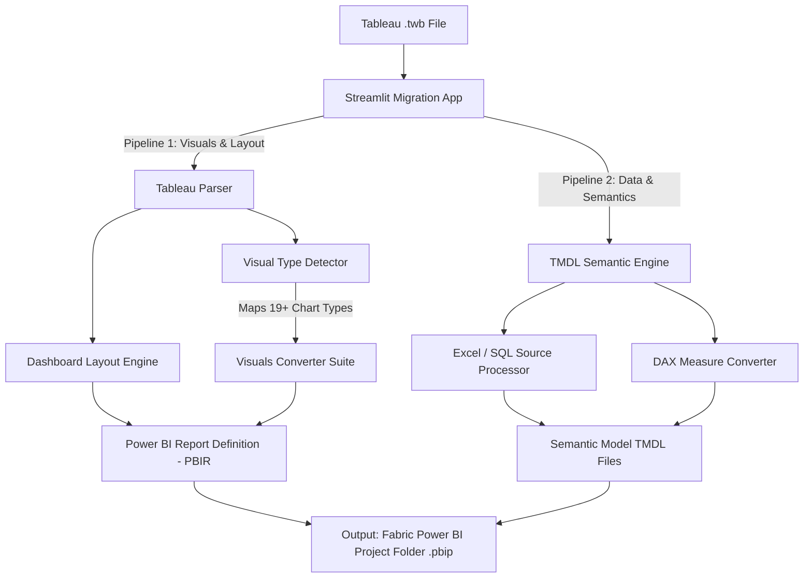

# 🔄 Tableau to Power BI Migration Utility

[](https://www.python.org/)
[](https://streamlit.io/)
[](https://powerbi.microsoft.com/)
[](https://www.tableau.com/)
[](LICENSE)

An advanced, end-to-end Python migration suite designed to accelerate the transition from Tableau to Power BI (Microsoft Fabric). This utility parses Tableau workbook (`.twb`) XML configurations and translates them directly into **Power BI Report Definition (PBIR) layouts** and **Tabular Model Definition Language (TMDL) semantic models**.

---

## 📌 Table of Contents

- [Core Features](#-core-features)
- [Repository Structure](#-repository-structure)
- [Conversion Architecture](#-conversion-architecture)
  - [1. Report & Layout Visual Engine](#1-report--layout-visual-engine)
  - [2. TMDL Semantic Model Builder](#2-tmdl-semantic-model-builder)
  - [3. Standalone Hyper Data Extractor](#3-standalone-hyper-data-extractor)
- [Supported Visualizations](#-supported-visualizations)
- [Getting Started](#-getting-started)
  - [Prerequisites](#prerequisites)
  - [Installation](#installation)
  - [Running the Streamlit UI](#running-the-streamlit-ui)
- [Detailed Walkthrough](#-detailed-walkthrough)
  - [Step 1: Upload and Map Schema](#step-1-upload-and-map-schema)
  - [Step 2: Choose Layout Replication Mode](#step-2-choose-layout-replication-mode)
  - [Step 3: Define Output Folders and Execute](#step-3-define-output-folders-and-execute)
- [Output Format Standards](#-output-format-standards)
  - [Power BI Report Definition (PBIR)](#power-bi-report-definition-pbir)
  - [Semantic Model (TMDL)](#semantic-model-tmdl)

---

## 🚀 Core Features

*   **Interactive Column & Table Mapping:** Preview and rename source Tableau tables and database columns dynamically before conversion to resolve Power BI syntax restrictions.
*   **High-Fidelity Dashboard Replication:** Replicates pixel-perfect layouts, dashboard canvas sizing, visual zones, sheet sizes, and absolute screen coordinates onto Power BI report canvas definitions.
*   **Fabric-Compatible Visual Outputs:** Auto-generates structured folders with individual `visual.json` files using the modern **Microsoft Fabric PBIR (v2)** schema.
*   **Automated TMDL Generation:** Transforms Tableau connections (Excel, SQL Server, Federated) into Tabular Model Definition Language (TMDL) files complete with lineage tags, relationships, folders, and calculated measure conversions.
*   **Measures & Aggregation Mapping:** Translates Tableau calculated fields, aggregates (SUM, AVG, MIN, MAX), and properties into valid Power BI measures.
*   **Hyper Extract Data Layer Extraction:** Provides a utility to read Tableau `.hyper` files directly and export schemas and data into Excel/CSV.

---

## 📂 Repository Structure

The workspace is organized into isolated workspaces containing source Tableau code, conversion assets, generated Power BI output, and the core conversion codebase:

```text
├── Codes 2/                       # Primary utility codebase
│   ├── Codes/                     
│   │   ├── main.py                # Streamlit Web Application entry point
│   │   ├── requirements.txt       # Python dependencies (Streamlit, Pandas, NumPy)
│   │   ├── Semantic_Model/        # TMDL Generation Engine
│   │   │   ├── Semantic_mode_Main.py             # Entry-point controller for TMDL model
│   │   │   ├── Excel_Multi_Processor.py          # Processes multi-table Excel connections
│   │   │   ├── SQL_Multi_Processor.py            # Processes multi-table SQL queries
│   │   │   ├── Calculation_Integration.py       # Translates calculated fields to measures
│   │   │   └── Semantic_File_Writting_Functions.py  # Writes .tmdl schema templates
│   │   ├── utils/                 # Layout parsing and mapping utilities
│   │   │   ├── Tableau_Parser.py  # Parses .twb XML elements into JSON
│   │   │   ├── Dashboard.py       # Extracts visual panels & absolute coordinate layouts
│   │   │   ├── visual_detection.py# Detects and maps Tableau worksheet visual types
│   │   │   └── Mapper.py          # Extracts table-column schemas for mapping
│   │   └── Visuals/               # High-fidelity visual translators (19+ charts)
│   │       ├── bar.py             # Standard Bar chart mapping
│   │       ├── StackedBar.py      # Stacked Bar converter
│   │       ├── line.py            # Line and Time Series converter
│   │       ├── donut.py           # Donut visual mapper
│   │       ├── KPI_card.py        # KPI Card visual mapper
│   │       └── [14+ other visual-specific modules]
│   └── Codes.zip                  # Compressed packaging of the conversion utility
│
├── Data Extraction from hyper.py   # Standalone utility for extracting .hyper file extracts
├── Tableau/                       # Source Tableau workbooks (.twb, .twbx) & test data
│   ├── EV Dashboard.twb           # Complex Electric Vehicle Tableau dashboard
│   ├── Pie Chart.twbx             # Packaged Tableau workbook containing Pie visuals
│   └── EV_Usage_Dataset_v2.csv    # Source data file for validation
├── Power Bi/                      # Exported Power BI project definition folders (.pbip)
│   ├── Orders.pbip                # Recreated Orders semantic model and report layouts
│   ├── ev_test.pbip               # Migrated EV Dashboard output structure
│   └── train.pbip                 # Migrated training workbook output structure
├── PBI/                           # Sample Power BI files and binary archives
│   ├── BAR CHART_manish.pbip      # Individual Bar Chart migration target project
│   └── Superstore Data Dashboard.pbix # Full migrated dashboard binary
└── Shared_files_manish_sailesh/   # Shared testing assets containing benchmark Tableau/PBI source pairs
```

---

## ⚙️ Conversion Architecture



### 1. Report & Layout Visual Engine
*   **Tableau Parser (`Tableau_Parser.py`):** Translates Tableau XML markers into a clean intermediate JSON structure representing worksheet parameters, dimension/measure roles, formatting marks, and sheet-level filter configurations.
*   **Visual Detection (`visual_detection.py`):** Uses structured rules to inspect encodings (rows, columns, marks, detail shelves) and automatically identify which visual type represents the worksheet (e.g. Pivot Table vs KPI Card vs Heatmap).
*   **Dashboard Sizer & Coordinator (`Dashboard.py`):** Inspects Tableau's zone hierarchies to extract absolute coordinate mappings (x, y, width, height) of visual dashboard elements, preserving the exact layout proportions on Power BI's canvas layout.

### 2. TMDL Semantic Model Builder
*   **Source Connections Mapping (`Excel_Multi_Processor.py`, `SQL_Multi_Processor.py`):** Dynamically extracts server routes, SQL commands, spreadsheet links, and schemas, structuring them into equivalent Power Query M expressions.
*   **Relationships Configuration (`Semantic_File_Writting_Functions.py`):** Maps join queries and foreign key constraints between databases or worksheets to set up correct relationships in `relationships.tmdl`.
*   **Date Model Integration:** Detects date columns and auto-generates central time-dimension variables and local date tables (`DateTableTemplate.tmdl`).

### 3. Standalone Hyper Data Extractor
*   **Hyper API Utility (`Data Extraction from hyper.py`):** Directly hooks into Tableau's high-performance proprietary database storage engine (`.hyper`) through Python's `tableauhyperapi`, dumping table metadata and dataset records straight to standard Excel or CSV sheets for fast loading into Power BI.

---

## 📊 Supported Visualizations

The utility translates Tableau mark settings, formatting, filters, and shelves into modern native Power BI visual properties.

| Tableau Visual Setup | Power BI Native Element | Converter Module | Key Translated Properties |
| :--- | :--- | :--- | :--- |
| **Bar / Column Chart** | `barChart` / `columnChart` | `bar.py` | Colors, Category labels, Legend placements, Sorting |
| **Stacked Bar / Column** | `stackedBar` / `stackedColumn` | `StackedBar.py` | Grouping attributes, Segment colors, Tooltip info |
| **Line / Time Series** | `lineChart` | `line.py` | Continuous date hierarchies, markers, line styles |
| **Pie Chart** | `pieChart` | `pie.py` | Slices, angles, category labels, value formatters |
| **Donut Chart** | `donutChart` | `donut.py` | Inner radius percentages, legend placement |
| **Area Chart** | `areaChart` | `area.py` | Shaded boundaries, opacity, stacking options |
| **Treemap** | `treemap` | `treemap.py` | Box groups, size dimensions, hierarchy tiles |
| **Heatmap** | `heatmap` (Matrix-based) | `heatmap.py` | Color scales, density grids, cell values |
| **KPI Card** | `card` | `KPI_card.py` | Main measure value, dynamic cards, label styling |
| **Multi-row Card** | `multiRowCard` | `multicard.py` | Nested fields, spacing, card border layouts |
| **Standard / Cross Table** | `table` | `table.py` | Columns, aggregate values, standard grid stylings |
| **Pivot Table** | `matrix` | `pivot.py` | Drill-down rows/columns, sub-total aggregates |
| **Dual Axis Chart** | `comboChart` (Dual Y-Axes) | `dual_axis.py` | Scale ranges, overlapping series, dual axis toggles |
| **Funnel Chart** | `funnel` | `funnel_chart.py` | Conversion stages, sorted value metrics |
| **Waterfall Chart** | `waterfallChart` | `waterfall.py` | Variance breakdowns, absolute totals |

---

## ⚡ Getting Started

### Prerequisites
*   **Python 3.9** or higher
*   Installed Tableau Hyper API driver (only if utilizing `.hyper` extract scripts)
*   **Microsoft Power BI Desktop** (Enhanced Report Format enabled in options)

### Installation

1. Clone or unpack the migration workspace:
   ```bash
   cd "Tableau_to power_bi_migration_code/Codes 2/Codes"
   ```

2. Install the necessary dependencies:
   ```bash
   pip install -r requirements.txt
   ```

### Running the Streamlit UI

Launch the Streamlit interactive dashboard application from your command shell:
```bash
streamlit run main.py
```

---

## 🛠️ Detailed Walkthrough

### Step 1: Upload and Map Schema
1. **Upload Workbook:** Drag and drop your target Tableau `.twb` file into the Streamlit uploader.
2. **Schema Mapping Verification:** The utility automatically parses the Tableau connection metadata and displays an editable schema mapper.
3. **Refine Name Identifiers:** Edit target Table Names or specific Columns directly inside the UI. Power BI does not support special characters or duplicate column headers in identical scopes.
4. **Export Configuration:** Click `Download Renamed Mapping JSON` to preserve your adjustments (`renamed_mapping.json`).

### Step 2: Choose Layout Replication Mode
*   **Option A (Replicate Dashboard Layout):** Extracts dashboard sheets and places each chart on a Power BI canvas page at the exact coordinates ($X, Y$) and size dimensions ($W, H$) as defined in the source dashboard container.
*   **Option B (Generate Worksheets):** Creates individual canvas layouts for selected worksheets with default fluid positioning (ideal for ad-hoc sheet conversion).

### Step 3: Define Output Folders and Execute
1. Select the conversion task:
   - **Report Processing:** Generates Power BI visual frames (`definition/pages/...`).
   - **Semantic Model Generation:** Generates Power BI TMDL schemas (`definition/tables/...`).
   - **Both:** Performs a full migration in a single run.
2. Provide a custom path under **Definition Folder Setup** (defaults to generating on your local Desktop).
3. Press **▶️ Run**. The utility parses the files, formats properties, maps aggregations, and saves the output assets immediately.

---

## 📐 Output Format Standards

The utility exports files compliant with the native, developer-friendly **Power BI Project (`.pbip`) / Microsoft Fabric** design system, allowing direct version control via Git.

### Power BI Report Definition (PBIR)
Visual definitions are created under the `/definition/pages/` folder hierarchy:
```text
definition/
├── pages/
│   ├── pages.json                      # Overall page layout order and active tabs
│   └── [Page-GUID]/                    # Specific Report Canvas Page
│       ├── page.json                   # Visual canvas options, heights, and titles
│       └── visuals/
│           └── [Visual-GUID]/
│               └── visual.json         # Fabric Visual schema properties (size, type, query fields)
```

### Semantic Model (TMDL)
Semantic connections and models are generated using standard **TMDL** structure, ready to be read by Power BI Desktop or deployed via XMLA endpoints:
```text
definition/
├── database.tmdl                        # Connection name and database ID definitions
├── model.tmdl                           # Central listing of tables, roles, and cultures
├── relationships.tmdl                   # Join dimensions, cardinalities, and directions
└── tables/
    ├── Customer.tmdl                    # TMDL schema for specific tables
    ├── Sales.tmdl                       # TMDL schema with columns, lineages, and calculations
    ├── DateTableTemplate.tmdl           # Custom DAX Date Table schema
    └── LocalDateTable_[GUID].tmdl       # Native Power BI Auto-Date tables
```

---

> [!TIP]
> **Pro-Tip for Developers:** Once the `definition` folders are generated, you can open your Power BI Desktop client, configure a new `.pbip` project directory, and replace its `definition` subdirectories with the ones produced by this utility. Saving or editing in Power BI automatically builds the binary `.pbix` for direct publishing!
