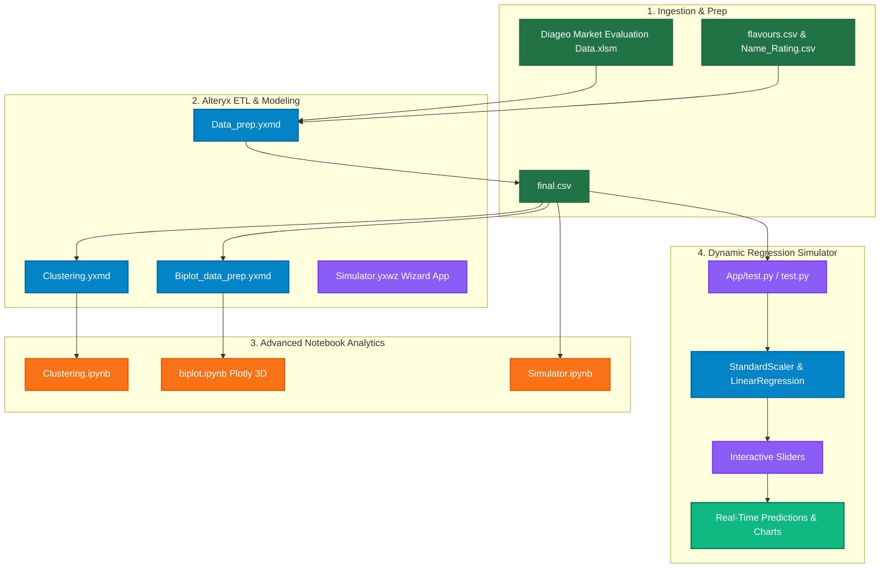

# 🥃 SMART Distillery - Diageo Market Evaluation & Flavor Simulator (Track 3)

Welcome to the **SMART Distillery Market Evaluation & Flavor Simulator** repository (Track 3). This track contains advanced sensory profiling data pipelines, K-Means clustering, interactive 3D PCA biplots, and a live Streamlit-based linear regression simulation application.

This repository serves as a decision-support platform for Diageo’s blending and quality assurance teams. It translates complex, multi-dimensional flavor/sensory evaluation sheets into real-time ratings predictions, highlighting key organoleptic drivers of consumer preferences.

---

## 📊 Analytics Pipeline & Architecture

The analytical ecosystem is split into **Alteryx pipelines** (for ETL, data scaling, and structured clustering) and **Python/Streamlit workflows** (for real-time sensory simulation and dynamic regression modeling).



---

## 📁 Repository Structure

### 💻 Streamlit Web Applications (`App/` & Root)

* **[`App/test.py`](file:///c:/Users/User/Desktop/Kriyanshi/Crg/Track%203/App/test.py)** (Preconfigured Diageo Simulator):
  * Pre-loaded with the Diageo historical market dataset (`final.csv`).
  * Features an interactive sidebar containing model configurations where users can adjust target variables (defaulting to `Rating`) and select custom independent flavor parameters.
  * Normalizes the feature data using `StandardScaler` and trains a `LinearRegression` model in real-time.
  * Generates an interactive weight analysis dashboard, letting users see the mathematical coefficient of each flavor note.
  * Employs interactive sliders for 22+ sensory attributes (e.g. `Sweet_rating`, `Bitter_rating`, `UT_Fruit-No_rating`, `Aged_Wood-No_rating`) to simulate and predict brand ratings dynamically.

* **[`test.py`](file:///c:/Users/User/Desktop/Kriyanshi/Crg/Track%203/test.py)** / **[`App/test2.py`](file:///c:/Users/User/Desktop/Kriyanshi/Crg/Track%203/App/test2.py)** (Generic File-Uploader Simulator):
  * Offers the exact same regression simulation pipeline but adds a generic file-uploader component at the top, enabling users to upload any sensory evaluation CSV file on-the-fly.

---

### 🧪 Jupyter Notebooks (`.ipynb`)

* **[`Clustering.ipynb`](file:///c:/Users/User/Desktop/Kriyanshi/Crg/Track%203/Clustering.ipynb)**:
  * Performs Exploratory Data Analysis (EDA) on `final.csv`.
  * Builds distance-based clustering algorithms to partition spirit flavor profiles into distinct segments.
  * Evaluates optimal grouping thresholds and outputs segmented observations for further analysis.

* **[`biplot.ipynb`](file:///c:/Users/User/Desktop/Kriyanshi/Crg/Track%203/biplot.ipynb)**:
  * Performs Principal Component Analysis (PCA) to reduce multi-dimensional flavor space into 3 main principal axes.
  * Employs Plotly to build an interactive, rotatable 3D biplot (`scatter3d`) representing both the observation points (blends) and dimensional feature vectors (loadings).

* **[`Simulator.ipynb`](file:///c:/Users/User/Desktop/Kriyanshi/Crg/Track%203/Simulator.ipynb)**:
  * The back-end prototyping notebook for the regression models, validating coefficient stability, collinearity, and Z-score mapping before deploying the Streamlit interface.

---

### ⚙️ Alteryx Workflows & Macros (`.yxmd`, `.yxwz`, `.yxzp`)

* **`Data_prep.yxmd`**: Joins raw Excel inputs, cleans text categories, filters nulls, and structures the master `final.csv` dataset.
* **`Clustering.yxmd`**: Runs built-in clustering modules to output coordinates and segment tags.
* **`Biplot_data_prep.yxmd`**: Normalizes covariance structures and maps variance loadings to prepare files for PCA plotting.
* **`Simulator.yxwz`**: An Alteryx Wizard Analytic App that allows operators to key in parameter adjustments directly within the Alteryx environment.
* **`scaling_macro_demo.yxzp`**: A packaged workflow demonstrating Alteryx scaling macros to replicate Z-score normalization inside database streams.

---

### 🗃️ Datasets & Artifacts (`.csv`, `.xlsm`)

* **`final.csv`**: The master dataset (4,620 observations, 27 features) representing detailed flavor profiles mapped to final sensory ratings.
* **`flavours.csv`**: Reference glossary containing descriptions and classifications of the specific flavor families.
* **`Name_Rating.csv`**: Historical brand reference directory mapping specific spirit codes to overall market scores.
* **`centroids4.csv` & `centroids7.csv`**: Coordinates for 4-cluster and 7-cluster solutions, respectively, mapping average sensory centers.
* **`clusters4_process.csv`**: Data mapping observations to their respective 4-cluster segments.
* **`biplot_data.csv` & `biplot_data_Alteryx.csv`**: Scaled PCA loadings and scores used to construct the interactive 3D biplots.
* **`Diageo Market Evaluation Data.xlsm`**: Master Excel workbook with raw sensory scores, formulas, and baseline sheets.
* **`Diageo Market Evaluation PPT.pdf`**: Comprehensive evaluation report mapping business findings, sensory metrics, and brand positioning.

---

## 🔬 Core Modeling & Mathematical Framework

### 1. Standardized Linear Regression Simulator
To prevent larger-scale ratings (e.g. higher mean values) from distorting weights, the simulator dynamically scales sensory attributes prior to regression training. 

Independent attributes $X$ are normalized using Z-score standardization:

$$z_i = \frac{x_i - \mu_i}{\sigma_i}$$

Where $\mu_i$ is the feature mean and $\sigma_i$ is the feature standard deviation. The linear predictor model then evaluates:

$$\hat{y} = \beta_0 + \sum_{i=1}^{k} \beta_i z_i$$

Where $\beta_i$ representing standardized coefficients (feature weights) are displayed directly in the Streamlit sidebar, letting blending teams easily see which sensory variables are highly positive (sweetness, fruitiness) vs. highly negative (rubbery, sourness).

### 2. Distance-Based K-Means Clustering
Flavor classification splits the multidimensional profiles into cohesive segments by minimizing the within-cluster sum of squares (WCSS):

$$\arg\min_{\mathbf{S}} \sum_{i=1}^{K} \sum_{\mathbf{x} \in S_i} \left\| \mathbf{x} - \boldsymbol{\mu}_i \right\|^2$$

Where $\boldsymbol{\mu}_i$ represents the sensory centroids stored in `centroids4.csv` and `centroids7.csv`. This groups similar flavor signatures together, allowing marketing and production teams to target specific taste segments.

### 3. Principal Component 3D Biplot Loading
To represent 20+ sensory dimensions in a readable 3D format, PCA projects variance along orthogonal axes:

$$\mathbf{t}_k = \mathbf{X} \mathbf{p}_k$$

Where $\mathbf{p}_k$ are the load vectors (loadings) mapped in `biplot_data.csv`. The interactive Plotly graph allows blenders to rotate through these three dimensions ($PC_1, PC_2, PC_3$) to analyze how close individual brand profiles map to vector gradients.

---

## 🛠️ Environment Setup & Execution

### Prerequisites
* **Python 3.9+** (recommended 3.10)
* Virtual environment tool (e.g. `venv` or `conda`)

### 1. Install Python Dependencies
Install the required packages using the preconfigured requirements list:
```bash
pip install -r req.txt
```
*Note: If `req.txt` is missing, you can install the packages directly:*
```bash
pip install streamlit pandas scikit-learn plotly matplotlib openpyxl
```

### 2. Running the Streamlit App
To launch the interactive blending simulator, execute:
```bash
streamlit run App/test.py
```
This will spin up a local development server and automatically open the application in your default web browser (typically at `http://localhost:8501`).

### 3. Running the Jupyter Notebooks
Open the notebooks using your preferred editor or launch the local notebook workspace:
```bash
jupyter notebook
```

---

> [!NOTE]
> When running the Streamlit app (`App/test.py`), ensure `final.csv` is present in the workspace or verify that absolute directory references pointing to `D:\CRG\Diageo\final.csv` are modified to point to your local environment.

> [!TIP]
> The generic simulator (`test.py` in root directory) is highly recommended if you wish to run simulations on non-Diageo sensory files. Simply upload your custom CSV, select your target column, and begin adjusting sliders!
