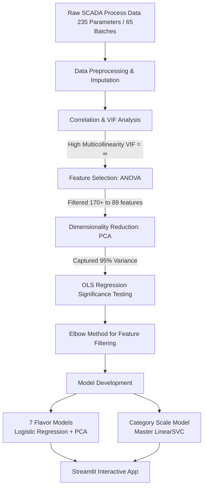

# 🥃 Whiskey Flavor Predictor (Smart Distillery Analytics)

[](https://www.python.org/)
[](https://streamlit.io/)
[](https://scikit-learn.org/)
[](#)

An advanced Machine Learning predictive pipeline and interactive simulator designed to analyze and optimize the whiskey distillery process. By tracking process parameters across all key production stages—Mashing, Fermentation, Wash Distillation, and Spirit Distillation—the system models individual flavor profiles and predicts the final whiskey batch quality.

---

## 📌 Project Overview & Scope

In whiskey manufacturing, maintaining sensory consistency is critical. Flavor characteristics are driven by a complex interplay of process parameters. This project provides a **Smart Distillery Analytics** solution that:
*   **Bridges Process & Sensory Data**: Connects 235 SCADA process parameters with panel consensus scores (TC Consensus Score) for 65+ commercial batches.
*   **Decouples Multicollinearity**: Applies statistical feature engineering to resolve highly correlated process variables.
*   **Predicts Flavor Profiles**: Models the presence/absence and intensity of **7 distinct flavor profiles**.
*   **Assesses Overall Quality**: Classifies final batch quality as `GOOD` or `BAD` using a master category scale model.
*   **Enables Simulation**: Features a Streamlit-based web dashboard allowing distillers to interactively tune process sliders and instantly observe simulated flavor and quality outcomes.

---

## ⚙️ The Analytical Pipeline



### 🔬 Methodology Breakdown

#### 1. Data Cleaning & Imputation
SCADA process measurements from **Mashing, Fermentation, Wash Still A/B, and Spirit Still A/B** are collected. Missing values are automatically handled using numeric mean imputation to ensure robust data matrices for downstream modeling.

#### 2. Multicollinearity Resolution (Correlation & VIF)
*   **The Problem**: Initial correlation matrices revealed that almost all SCADA parameters showed significant inter-correlations (coefficient $\geq 0.8$ or between $-0.3$ and $0.3$ with targets), resulting in an infinite Variance Inflation Factor ($VIF = \infty$). This severe multicollinearity destabilizes standard logistic regression coefficients and inflates variance.
*   **Why Forward/Backward Stepwise Selection Fails Alone**:
    *   **Backward Selection**: Fails completely in high-dimensional settings when features exceed sample size ($p > n$), is highly unstable under multicollinearity, and is computationally slow.
    *   **Forward Selection**: Tends to select arbitrary variables from groups of highly correlated features, misses complex non-linear feature interactions, and prioritizes raw empirical fit over physical/chemical explainability.
*   **The Solution**: An integrated **ANOVA $\rightarrow$ PCA $\rightarrow$ OLS $\rightarrow$ Elbow** pipeline:
    1.  **ANOVA Screening**: Screens and reduces raw parameters down to statistically significant variables (reducing $170+$ variables to $89$).
    2.  **PCA (Principal Component Analysis)**: Projects correlated process variables into orthogonal, completely independent principal components capturing $\geq 95\%$ of data variance.
    3.  **OLS Regression**: Tests individual components for statistical significance ($p < 0.05$).
    4.  **Elbow Method**: Pinpoints the optimal parameter subset contributing most to these significant components (highlighting parameters like *Chloride (Max)* and *Hardness (Max)* as principal drivers).

---

## 📊 Machine Learning Modeling Framework

The project deploys two distinct types of modeling architectures:

### 1. Flavor Intensity & Presence Models
Dedicated **Logistic Regression** models are trained for each of the 7 primary sensory notes. 
*   **Absence/Presence**: Binary classification determined by comparing predicted probabilities against a tailored threshold.
*   **Intensity Quantification**: The probability score ($0.00$ to $1.00$) output by each model serves directly as the flavor's intensity level.

### 2. Category Scale (Overall Quality) Model
A master **Linear Support Vector Classifier (LinearSVC)** predicts whether the final batch quality is `GOOD` or `BAD`.
*   **Feature Integration**: Trained on the union of all key features from the individual flavor models.
*   **Decision Function Confidence**: Converts the raw SVC decision boundary score into a probability confidence score using a sigmoid function:
    $$\text{Confidence} = \frac{1}{1 + e^{-\text{Score}}}$$
*   **Decision Threshold**: $\ge 0.76$ is categorized as `GOOD` quality whiskey.
*   **Why LinearSVC**: Performs exceptionally well with high-dimensional features, avoids overfitting on moderate sample sizes, and builds a robust margin separator.

---

## 🏆 Model Performance & Specifications

Below is a detailed breakdown of the 7 flavor models and the master quality classifier:

| Flavor / Scale Profile | Emoji | Key Process Drivers (ANOVA & PCA Selected) | Presence Threshold | Train Accuracy | Test Accuracy |
| :--- | :---: | :--- | :---: | :---: | :---: |
| **Cereal / Grainy** | 🟤 | Wort initial/final gravity, screening below 2.2mm, final wash temperature, yeast storage temp, wash turbidity, Spirit Still temperature | `> 0.70` | **100%** | **88%** |
| **Fruity & Floral** | 🌸 | Mashing temperature, Mashtun temperatures (Spezyme/Diazyme), strength in PL, setup wort pH/gravity, wash distillation rate | `> 0.50` | **93%** | **94%** |
| **Fermented** | 🍺 | Setup wort pH, wort final gravity, malt foreign matter, low wine alcohol %, malt hot water extract, spirit distillation rate | `> 0.50` | **93%** | **94%** |
| **Husky** | 🌾 | Spirit Still temperature, sparging water temp, wash condenser temp, weak wort output temp, grist course milling ratio | `> 0.50` | **81%** | **80%** |
| **Starchy** | 🥔 | Strength in PL, average ABV in FMS, draff loss, screening below 2.2mm, recovery PL/ton malt, mashing temp, setup pH | `> 0.40` | **68%** | **69%** |
| **Cooked** | 🍳 | Optimash TBG shelf life, Wash Still temperature, enzyme addition time (Proteinase T), Spirit condenser temp, process water pH | `> 0.30` | **43%** | **44%** |
| **Acidic / Solvent** | 🧪 | Strength in PL, average ABV in FMS, wort final gravity, mashing temp, low wine turbidity, wort initial gravity | `> 0.50` | **50%** | **50%** |
| **Category Scale (Quality)**| ⚖️ | *Union of all above features (Standardized inputs)* | `> 0.76` | **70%** | **67%** |

---

## 🖥️ Streamlit Web Application

The interactive web dashboard brings this predictive engine to life. Users can:
1.  **Configure Sliders**: Adjust "Common Parameters" (parameters that affect multiple flavor notes simultaneously) and "Unique Parameters" (affecting only a single flavor).
2.  **Adjust Bounds**: Expand the **⚙️ Parameter Ranges** section to customize the minimum and maximum ranges of the sliders for extensive edge-case testing.
3.  **Real-Time Simulation**: As sliders move, the app transforms features, runs them through the PCA and model pipelines, and instantly prints:
    *   **Absence/Presence** (colored badges: Green for Present, Red for Absent).
    *   **Probability Intensity Metrics** alongside decision scores.
    *   **Model Accuracy benchmarks** for immediate transparency.
4.  **Batch Quality Prediction**: Displays a comprehensive final card summarizing whether the predicted settings will yield a `GOOD` or `BAD` quality batch, accompanied by a dynamic confidence percentage.

---

## 📁 Repository Structure

```directory
├── app/
│   ├── models/                    # Pickled scaler, PCA, model, and range files per flavor
│   │   ├── cereal_grainy/
│   │   ├── fruity_and_floral/
│   │   ├── fermented/
│   │   ├── husky/
│   │   ├── starchy/
│   │   ├── cooked/
│   │   ├── acidic_solvent/
│   │   └── category_scale/
│   └── streamlit_app.py           # Streamlit multi-panel simulator dashboard
├── data/
│   └── raw/
│       └── Final_output.xlsx      # Historical process & sensory database
├── training/
│   ├── train_flavour_model.py     # Script to clean, select ANOVA features, scale, run PCA & Logistic Reg
│   └── train_category_scale.py    # Script to train master LinearSVC quality scale model
├── Diageo_presentation.pptx       # Core presentation & analytical source of truth
├── PROJECT_DOCUMENTATION.md       # Detailed process and parameter listing
├── requirements.txt               # Dependencies list
└── README.md                      # This documentation
```

---

## 🚀 Getting Started

### 📋 Prerequisites
Ensure you have **Python 3.10+** (tested up to 3.14) installed on your system.

### 🔌 Installation & Setup

1.  **Clone the Repository**:
    ```bash
    git clone https://github.com/crgsolutions-repo/whiskey-predictor-kriyanshi.git
    cd Whiskey_Predictor
    ```

2.  **Install Required Dependencies**:
    ```bash
    pip install -r requirements.txt
    ```

3.  **Train the Models** *(Optional - Pretrained models are included in `models/`)*:
    To train the individual flavor models:
    ```bash
    cd training
    python train_flavour_model.py
    ```
    To train the master overall quality category scale model:
    ```bash
    python train_category_scale.py
    cd ..
    ```

4.  **Launch the Streamlit Web Application**:
    ```bash
    streamlit run app/streamlit_app.py
    ```
    This will open your default browser to `http://localhost:8501`. Happy distilling! 🥃
